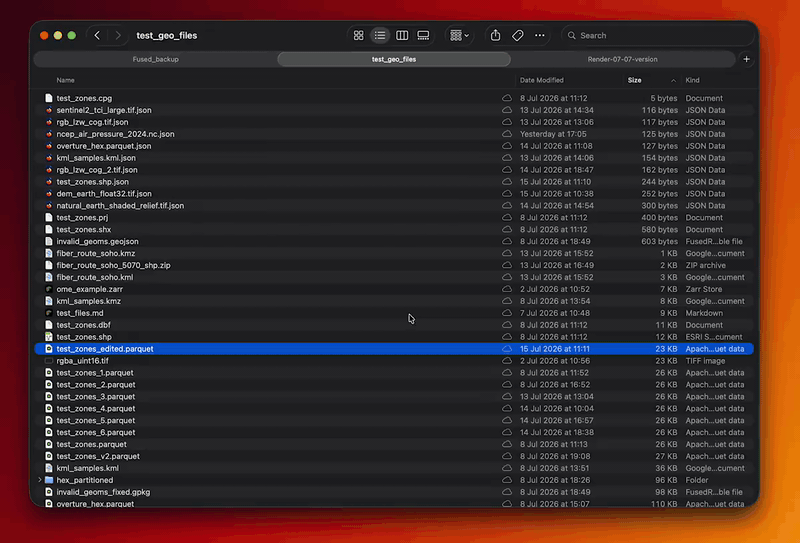

# fused-render

**[Download for macOS, Windows, and Linux →](https://render.fused.io)**

Your files, your AI, your apps — on your own machine. Browse any directory in
the browser, run AI models locally, and describe an app for Claude Code to
build. Any `.html` file you open gets a tiny injected runtime that can call a
Python `main()` function and sync its state to the URL.

Runs entirely on `127.0.0.1`. No accounts, no cloud, no sandboxing — your own
machine, your own trusted code.

## Download

Download from **[render.fused.io](https://render.fused.io)**:

- **macOS** — `.dmg`, Apple silicon
- **Windows** — 64-bit `.exe` installer
- **Linux** — AppImage

macOS is the native build; Windows and Linux have limited support. Trouble on
first run? See [troubleshooting](https://render.fused.io/#troubleshooting).

### Other ways in

**Homebrew** — the same macOS app, from the tap:

```
brew install --cask fusedio/tap/fused-render
```

**GitHub releases** — every build the download page serves is also attached to
its [release](https://github.com/fusedio/fused-render/releases), if you want an
older version or a checksum.

**Python package** — for running fused-render inside a Python environment you
already have, rather than as a desktop app. Each release attaches a wheel (see
the release notes for its URL): `pip install <wheel-url>`. From a source
checkout:

```
pip install -e .
```

Requires Python 3.11+. Building from source and the local dev loop live in
[CONTRIBUTING.md](CONTRIBUTING.md).

## What's in it

Home opens on a file search, with everything on this machine below it:

- **Apps** — describe one in a sentence; Claude Code names it, scaffolds it,
  and opens a chat on it. Community apps from the showcase are yours to open
  and edit in place.
- **AI models** — image, video (Apple silicon), speech-to-text and embeddings
  run locally, from the Playground or from your own pages. The AI Models page
  shows what's on disk and what fits this machine.
- **Claude Code, without the terminal** — every Claude session on this machine
  in one place, and Tasks: prompts that run on a schedule.
- **Files** — 140 preview templates: parquet, PDF, notebooks, spreadsheets,
  point clouds, and the rest. Remote storage mounts as folders.

## Run

The downloaded app opens Home in a browser tab. From a pip install it's a
command:

```
fused-render
```

Either way you land on `http://127.0.0.1:1777/`. Useful flags:

```
fused-render --start-dir ~/data --port 9000 --no-browser
```

`--start-dir` is where the explorer starts (default `~/Fused`); the whole
filesystem stays browsable from there.

### Windows: Explorer "Open with"



```
fused-render-open --register
```

Registers fused-render into Explorer's right-click "Open with" menu (HKCU
only, no admin) for every format it previews — double-clicking a file, or
picking "fused-render" from Open With, reuses a running server or starts one
detached, then opens the file. `fused-render-open --unregister`
removes the associations.

## Authoring

Any `.py` file is a runnable target as long as it defines a `main()`
function:

```python
# sine.py
import math

def main(n: int = 80, freq: float = 1.0):
    return {"points": [[i / n, math.sin(2 * math.pi * freq * i / n)] for i in range(n)]}
```

Any `.html` file can call it and bind the result to the URL:

```html
<input id="freq" type="range" min="0.1" max="5" step="0.1" />
<script>
  const slider = document.getElementById("freq");
  slider.addEventListener("input", () => fused.params.set("freq", slider.value));
  fused.params.onChange(draw);

  async function draw() {
    const freq = fused.params.get("freq") || "1.0";
    const { points } = await fused.runPython("./sine.py", { freq });
    // ...render points...
  }
  draw();
</script>
```

That injected runtime is the whole API:

- `fused.runPython(pyPath, params)` and `fused.params` — call `main(**params)`
  and keep a string key/value store in sync with the URL, so a refresh or a
  bookmark reproduces the view. `fused.readFile` / `writeFile` / `stat` /
  `rawUrl` read and write files directly, no Python needed.
  → [fused-render-authoring](skills/fused-render-authoring/SKILL.md)
- `fused.ai(prompt)` — ask Claude Code, or a local model when `model` is a
  Hugging Face repo id. `fused.ai.image` / `.video` / `.transcribe` / `.embed`
  run locally; `fused.ai.models` lists, loads and unloads them.
  → [fused-render-ai](skills/fused-render-ai/SKILL.md)
- `fused.trackJob` / `fused.watchJob` — long-running work in the download
  manager, whether your page is doing it or the server is.
  → [fused-render-jobs](skills/fused-render-jobs/SKILL.md)

Every built-in preview template is an HTML file on these same primitives —
`fused_render/templates/` has 140 of them to copy from.

## Configuration

[docs/usage.md](docs/usage.md) covers the
[execution engine](docs/usage.md#execution-engine),
[remote storage mounts](docs/usage.md#remote-storage-mounts),
the [AI Models page](docs/usage.md#ai-models),
[preferences](docs/usage.md#preferences), and
[export for hosted serving](docs/usage.md#export-for-hosted-serving).

## Claude Code plugin

This repo doubles as a [Claude Code](https://code.claude.com/docs) plugin
marketplace. Its skills teach Claude to run the app, author views, use local AI
and jobs, and build preview templates — the same skills under `skills/`.

From inside Claude Code:

```
/plugin marketplace add fusedio/fused-render
/plugin install fused-render@fused-render
```

Or from the command line:

```
claude plugin marketplace add fusedio/fused-render
claude plugin install fused-render@fused-render
```

The manifests live in `.claude-plugin/` (`marketplace.json` + `plugin.json`).

Installing is optional and only affects *your own* Claude Code sessions. Chats
started from inside fused-render already get these skills: the app assembles
the same plugin under `~/.fused-render/skill-plugin/` and loads it per session
with `--plugin-dir`, so they work on a plain DMG or wheel install with nothing
cloned.
